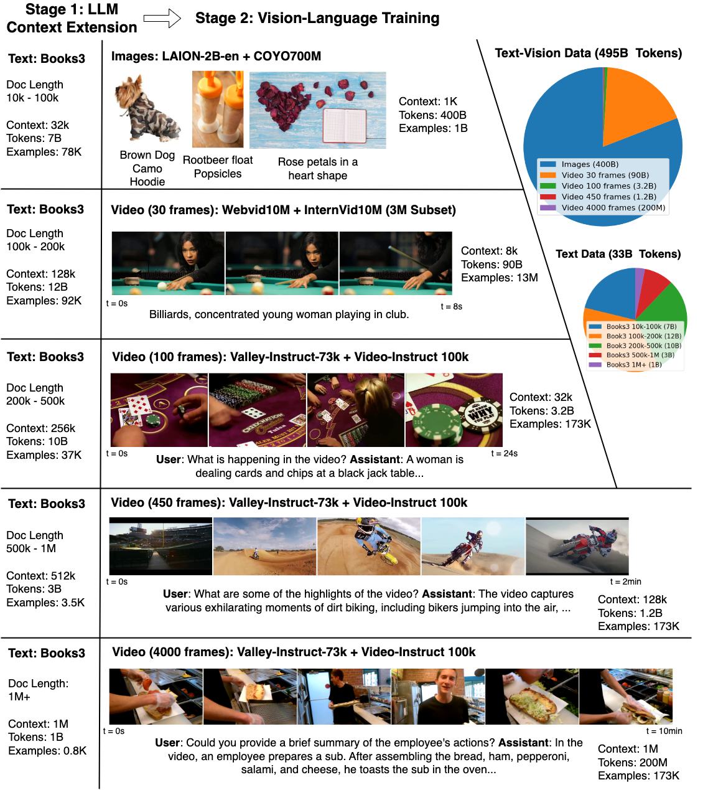
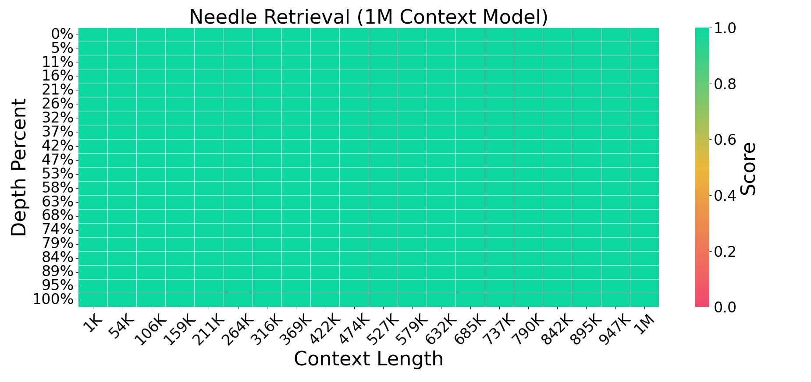
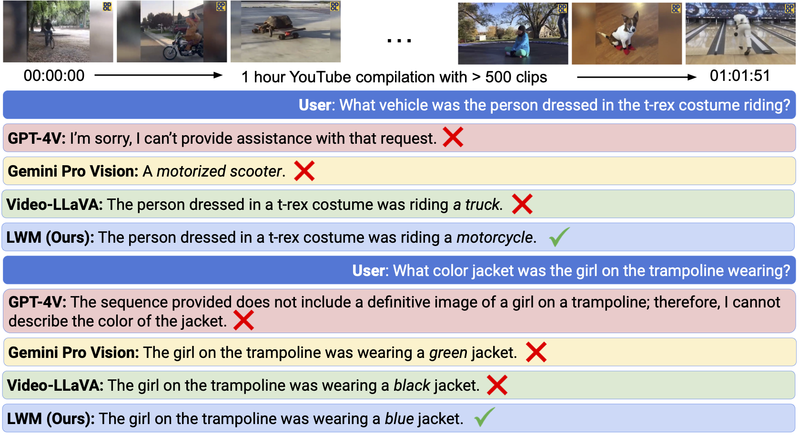
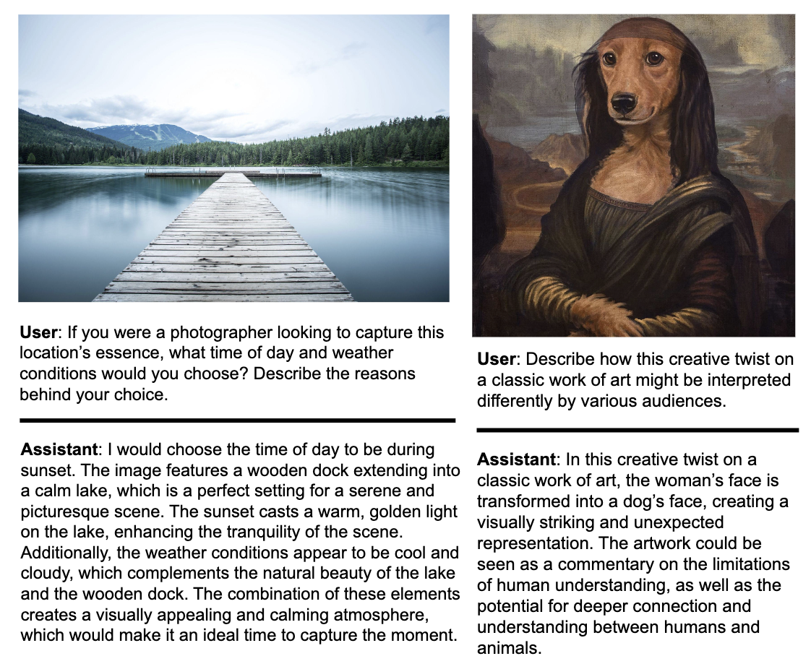
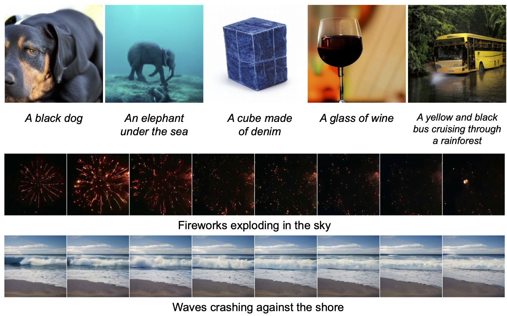

# Large World Model (LWM)

[[Project]](https://largeworldmodel.github.io/)
[[Paper]](https://arxiv.org/abs/2402.08268)
[[Models]](https://huggingface.co/LargeWorldModel)

**Large World Model (LWM)** is a general-purpose large-context multimodal autoregressive model. It is trained on a large dataset of diverse long videos and books using RingAttention, and can perform language, image, and video understanding and generation.


## Approach

<div align="center">
  
</div>

Current language models fall short in understanding aspects of the world not easily described in words, and struggle with complex, long-form tasks. Video sequences offer valuable temporal information absent in language and static images, making them attractive for joint modeling with language. Such models could develop a understanding of both human textual knowledge and the physical world, enabling broader AI capabilities for assisting humans. However, learning from millions of tokens of video and language sequences poses challenges due to memory constraints, computational complexity, and limited datasets. To address these challenges, we curate a large dataset of diverse videos and books, utilize the RingAttention technique to scalably train on long sequences, and gradually increase context size from 4K to 1M tokens. This paper makes the following contributions: (a) Largest context size neural network: We train one of the largest context size transformers on long video and language sequences, setting new benchmarks in difficult retrieval tasks and long video understanding. (b) Solutions for overcoming vision-language training challenges, including using masked sequence packing for mixing different sequence lengths, loss weighting to balance language and vision, and model-generated QA dataset for long sequence chat. (c) A highly-optimized implementation with RingAttention, masked sequence packing, and other key features for training on millions-length multimodal sequences. (d) Fully open-sourced a family of 7B parameter models capable of processing long text documents (LWM-Text, LWM-Text-Chat) and videos (LWM, LWM-Chat) of over 1M tokens.
This work paves the way for training on massive datasets of long video and language to develop understanding of both human knowledge and the multimodal world, and broader capabilities.

## LWM Capabilities

<div align="center">
  
  <p>
  LWM can retrieval facts across 1M context with high accuracy.
  </p>
</div>

<br />

<div align="center">
  
  <p>
  LWM can answer questions over 1 hour YouTube video.
  </p>
</div>

<br />

<div align="center">
  
  <p>
  LWM can chat with images.
  </p>
</div>

<br />

<div align="center">
  
  <p>
  LWM can generate videos and images from text.
  </p>
</div>


## Setup

This codebase is supported on Ubuntu and has not been tested on Windows or macOS. We recommend using TPUs for training and inference, although it is also possible to use GPUs. On TPU, the code is highly optimized with Jax's Pallas and can achieve high MFUs with RingAttention at very large context sizes. On GPU, the code is based on XLA and is not as optimized as it is for TPU.

Install the requirements with:
```
conda create -n lwm python=3.10
conda activate lwm
pip install -r gpu_requirements.txt
```
or set up TPU VM with:
```
sh tpu_requirements.sh
```


## Available models

There are language-only and video-language versions, offering context sizes from 32K, to 128K, 256K and 1M tokens. The vision-language models are available only in Jax, and the language-only models are available in both PyTorch and Jax. Below are the names of the available models and their corresponding context sizes and capabilities:

| Model Name         | Context Size | Language or Vision-Language | Chat or Base | URL                                                                                                                                          |
|--------------------|--------------|-----------------------------|--------------|----------------------------------------------------------------------------------------------------------------------------------------------|
| LWM-Text-Chat-128K | 128K         | Language                    | Chat         | [[Pytorch](https://huggingface.co/LargeWorldModel/LWM-Text-Chat-128K)][[Jax](https://huggingface.co/LargeWorldModel/LWM-Text-Chat-128K-Jax)] |
| LWM-Text-Chat-256K | 256K         | Language                    | Chat         | [[Pytorch](https://huggingface.co/LargeWorldModel/LWM-Text-Chat-256K)][[Jax](https://huggingface.co/LargeWorldModel/LWM-Text-Chat-256K-Jax)] |
| LWM-Text-Chat-512K | 512K         | Language                    | Chat         | [[Pytorch](https://huggingface.co/LargeWorldModel/LWM-Text-Chat-512K)][[Jax](https://huggingface.co/LargeWorldModel/LWM-Text-Chat-512K-Jax)] |
| LWM-Text-Chat-1M   | 1M           | Language                    | Chat         | [[Pytorch](https://huggingface.co/LargeWorldModel/LWM-Text-Chat-1M)][[Jax](https://huggingface.co/LargeWorldModel/LWM-Text-Chat-1M-Jax)]     |
| LWM-Text-128K      | 128K         | Language                    | Base         | [[Pytorch](https://huggingface.co/LargeWorldModel/LWM-Text-128K)][[Jax](https://huggingface.co/LargeWorldModel/LWM-Text-128K-Jax)]           |
| LWM-Text-256K      | 256K         | Language                    | Base         | [[Pytorch](https://huggingface.co/LargeWorldModel/LWM-Text-256K)][[Jax](https://huggingface.co/LargeWorldModel/LWM-Text-256K-Jax)]           |
| LWM-Text-512K      | 512K         | Language                    | Base         | [[Pytorch](https://huggingface.co/LargeWorldModel/LWM-Text-512K)][[Jax](https://huggingface.co/LargeWorldModel/LWM-Text-512K-Jax)]           |
| LWM-Text-1M        | 1M           | Language                    | Base         | [[Pytorch](https://huggingface.co/LargeWorldModel/LWM-Text-1M)][[Jax](https://huggingface.co/LargeWorldModel/LWM-Text-1M-Jax)]               |
| LWM-Chat-32K       | 32K          | Vision-Language             | Chat         | [[Jax](https://huggingface.co/LargeWorldModel/LWM-32K-Jax)]                                                                                  |
| LWM-Chat-128K      | 128K         | Vision-Language             | Chat         | [[Jax](https://huggingface.co/LargeWorldModel/LWM-128K-Jax)]                                                                                 |
| LWM-Chat-1M        | 1M           | Vision-Language             | Chat         | [[Jax](https://huggingface.co/LargeWorldModel/LWM-1M-Jax)]                                                                                   |


## Code structure
Use `scan_query_chunk_size` and `scan_key_chunk_size` to control the block size in blockwise compute of the self-attention. Use `scan_mlp_chunk_size` to control the block size in blockwise compute of the feedforward network. Use `scan_attention=True` and `scan_mlp=True` to enable/disable blockwise compute in the self-attention and feed-forward network. Use `remat_attention` and `remat_mlp` to control the rematerialization policy with `nothing_saveable` recommended.

You can use `mesh_dim=dp, fsdp, tp, sp` to control the degree of parallelism and RingAttention. It is a string of 4 integers separated by commas, representing the number of data parallelism, fully sharded data parallelism, tensor parallelism, and sequence parallelism.
For example, `mesh_dim='1,64,4,1'` means 1 data parallelism, 64 fully sharded data parallelism, 4 tensor parallelism, and 1 sequence parallelism. `mesh_dim='1,1,4,64'` means 1 data parallelism, 1 fully sharded data parallelism, 4 tensor parallelism, and 64 sequence parallelism for RingAttention.


## Running Jax Models
In this section, we provide instructions on how to run each of the provided scripts. For each script, you may need to fill in your own paths and values in the variables described in the beginning of each script.

To run each of the following scripts, use `bash <script_name>.sh`:
- Language model training: `bash scripts/run_train_text.sh`
- Vision-Language model training: `bash scripts/run_train_vision_text.sh`
- Single Needle Evals (Language Model): `bash scripts/run_eval_needle.sh`
- Multi Needle Evals (Language Model): `bash scripts/run_eval_needle_multi.sh`
- Sampling images (Vision-Language Model): `bash scripts/run_sample_image.sh`
- Sampling videos (Vision-LanguageModel): `bash scripts/run_sample_video.sh`
- Image / Video understanding (Vision-Language Model): `bash scripts/run_vision_chat.sh`

By default the `mesh_dim` argument puts all devices on `tp` (tensor parallelism). For longer sequences, you may want to include `sp`, which is the last dimension in the `mesh_dim`.

When running needle evals, you may need to adjust the `theta` and `max_sequence_length` arguments in the scripts depending on the model. Below shows the correct values for each model.

|                     | LWM-Text-128K /  LWM-Text-Chat-128K | LWM-Text-256K /  LWM-Text-Chat-256K | LWM-Text-512K / LWM-Text-Chat-512K | LWM-Text-1M / LWM-Text-Chat-1M |
|---------------------|:-----------------------------------:|:-----------------------------------:|:----------------------------------:|:------------------------------:|
| theta               |               10000000              |               10000000              |              25000000              |            50000000            |
| max_sequence_length |                131072               |                262144               |               524288               |             1048576            |


An example of filling out a script (`run_sample_video.sh`) is as follows
```bash
#! /bin/bash

export SCRIPT_DIR="$( cd -- "$( dirname -- "${BASH_SOURCE[0]}" )" &> /dev/null && pwd )"
export PROJECT_DIR="$( cd -- "$( dirname -- "$SCRIPT_DIR" )" &> /dev/null && pwd )"
cd $PROJECT_DIR
export PYTHONPATH="$PYTHONPATH:$PROJECT_DIR"

export llama_tokenizer_path="/path/to/ckpt/folder/tokenizer.model"
export vqgan_checkpoint="/path/to/ckpt/folder/vqgan"
export lwm_checkpoint="/path/to/ckpt/folder/params"

python3 -u -m lwm.vision_generation \
    --prompt='Fireworks over the city' \
    --output_file='fireworks.mp4' \
    --temperature_image=1.0 \
    --temperature_video=1.0 \
    --top_k_image=8192 \
    --top_k_video=1000 \
    --cfg_scale_image=5.0 \
    --cfg_scale_video=1.0 \
    --vqgan_checkpoint="$vqgan_checkpoint" \
    --n_frames=8 \
    --mesh_dim='!1,1,-1,1' \
    --dtype='fp32' \
    --load_llama_config='7b' \
    --update_llama_config="dict(sample_mode='vision',theta=50000000,max_sequence_length=32768,scan_attention=False,scan_query_chunk_size=128,scan_key_chunk_size=128,scan_mlp=False,scan_mlp_chunk_size=8192,scan_layers=True)" \
    --load_checkpoint="params::$lwm_checkpoint" \
    --tokenizer.vocab_file="$llama_tokenizer_path"
read
```


## Needle Haystack Data
Run `python scripts/create_needle_data.py`


## Running PyTorch Models
Only text and text chat models are currently supported for PyTorch inference. PyTorch models can be loaded as Hugging Face `LlamaForCausalLM` models. Run `python scripts/sample_pyt.py` to sample. You may need to separately install `torch`.

## Documentation

For more details on the codebase, please refer to the [data.md](docs/data.md) and [sharding.md](docs/sharding.md).
The [data.md](docs/data.md) provides details on the data processing and the [sharding.md](docs/sharding.md) provides details on the sharding and parallelism.


## If you have issues

This is based on the [codebase](https://github.com/lhao499/ring-attention) of BPT and RingAttention, with the necessary features for vision-language training. The training and inference have been tested on both TPUv3 and TPUv4.

If you encounter bugs, please open a GitHub issue!


## Citation

If you use this codebase, or otherwise found our work valuable, please cite:

```
@article{liu2023world,
    title={World Model on Million-Length Video and Language with RingAttention},
    author={Liu, Hao and Yan, Wilson and Zaharia, Matei and Abbeel, Pieter},
    journal={arXiv preprint},
    year={2024},
}
@article{liu2023ring,
    title={Ring Attention with Blockwise Transformers for Near-Infinite Context},
    author={Liu, Hao and Zaharia, Matei and Abbeel, Pieter},
    journal={International Conference on Learning Representations},
    year={2024}
}
@article{liu2023blockwise,
    title={Blockwise Parallel Transformer for Large Context Models},
    author={Liu, Hao and Abbeel, Pieter},
    journal={Advances in neural information processing systems},
    year={2023}
}
```

## License

LWM's code is released under the Apache 2.0 License. See [LICENSE](https://github.com/LargeWorldModel/lwm/blob/main/LICENSE) for further details. The models are released under the Llama-2 license.
